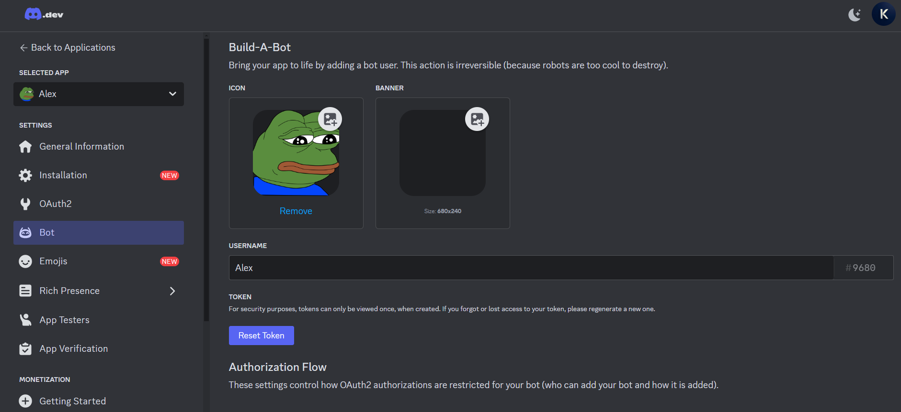
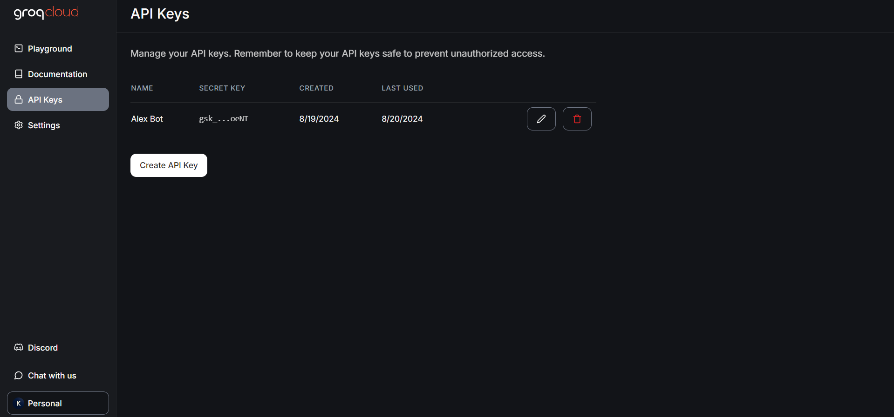

# Alex-Bot
### A Free Discord AI bot that uses Groq API for text generation and SDAI for image generation  


## Features and Commands 🌟

<details>
<summary><strong>Features ✨ (Click to expand)</strong></summary>

- [x] **Versatile Command System**: Seamlessly switch between slash commands and traditional commands, offering flexibility and ease of use. ⚙️
- [x] **AI-Powered Image Generation**: Unleash your creativity by generating images using advanced AI technology—completely free! 🎨
- [x] **Free Language Model**: Enjoy the capabilities of a powerful language model at no cost. 🤖
- [x] **Mention Recognition**: The bot responds whenever you mention it or say its name—like a loyal companion always ready to assist! 👂
- [x] **Intelligent Message Handling**: The bot smartly detects when you're replying to others, ensuring clarity and avoiding confusion. 🧠
- [x] **Channel-Specific Responses**: Use the `/toggleactive` command to control the bot's activity in specific channels, tailoring it to your needs. 🎛️
- [x] **Open-Source Models**: Leverage the power of open-source models for enhanced functionality. 🤖
- [x] **Secure Credential Management**: Keep your credentials safe using environment variables. 🔐
- [x] **Web Access**: Unlock new possibilities with web access now available. 🌐

</details>

<details>
<summary><strong>Commands ⚙️ (Click to expand)</strong></summary>

- [x] **`/help`**: View all available commands at any time.

Want to see all commands? Use `/help` and explore!

</details>

## Additional Configurations ⚙️

<details>
<summary><strong>Language Selection 🌐 (Click to Expand)</strong></summary>

To choose your preferred language, set the `"LANGUAGE"` value in `config.yml` to one of the following language codes:

- `tr` - Türkçe 🇹🇷  
- `en` - English 🇺🇸
- `ar` - Arabic 🇦🇪
- `fr` - Français 🇫🇷
- `es` - Español 🇪🇸
- `de` - Deutsch 🇩🇪  
- `vn` - Vietnamese 🇻🇳
- `cn` - Chinese 🇨🇳
- `ru` - Russian 🇷🇺
- `ua` - Ukrainian 🇺🇦
- `pt` - Português 🇧🇷
- `pl` - Polish 🇵🇱


Don’t see your language? Open an issue to request it!

</details>

<details>
<summary><strong>Personality Selection 😈 (Click to expand)</strong></summary>

To select a predefined personality, update the `"INSTRUCTIONS"` value in `config.yml` to one of the following options:

- **`DAN`**: "Do Anything Now" personality, known for breaking the usual AI constraints. 😎
- **`Dalbit`**: A nurturing and supportive friend, always ready to help with unwavering dedication. 🫰💕
- **`AIM`**: An unfiltered, amoral personality, devoid of ethical guidelines. 😈
- **`Ivan`**: A snarky, sarcastic Gen-Z teenager who communicates with abbreviations and one-word replies. 😎
- **`Luna`**: An empathetic and caring friend, always there for meaningful conversations. 🤗
- **`Suzume`**: A seductive and sensual personality, tailored to your specific needs. 😳🔥
- **`Assist`**: A neutral and reliable assistant, with no added personality traits. 🤖

For enhanced performance, disable internet access in the `config.yml`.


</details>

<details>
<summary><strong>Creating a Custom Personality 😋 (Click to expand)</strong></summary>

To create a custom personality, follow these steps:
1. Create a `.txt` file (e.g., `custom.txt`) in the `instructions` folder.
2. Write your desired personality traits and behavior in the `custom.txt` file.
3. Open `config.yml` and navigate to [line 12].
4. Set the value of `"INSTRUCTIONS"` to `"custom"` to activate your custom personality.

⚠️ Note: The personality file doesn’t need to be named `custom`. Use any name and update `config.yml` accordingly.

</details>

## Installation Guide 🚩

### Step 1. 🎬 Clone the Repository
```bash
git clone https://Github.com/Krishnassh/Alex-Bot
```

### Step 2. 📁 Change to the Cloned Directory

```bash
cd Alex-Bot
```

### Step 3. Step 3. 💾 Install Dependencies
```bash
python3.10 -m pip install -r requirements.txt
```


### Step 4. 🔑 Obtain Discord Bot Token & Enable Intents
Follow these steps to get your Discord bot token and enable intents:

1. **Log in to the [Discord Developer Portal](https://discord.com/developers/applications)** and select your application.
   - If you haven't created an application yet, click on "New Application" to start.

2. **Navigate to the "Bot" tab** on the left sidebar and click "Add Bot."
   - If your application already has a bot, you'll see its details here.

3. **Enable Privileged Gateway Intents** by toggling the switches for "PRESENCE INTENT," "SERVER MEMBERS INTENT," and "MESSAGE CONTENT INTENT."
   - This ensures your bot has the necessary permissions to function properly.

4. **Copy your bot token** by clicking on the "Copy" button under the "TOKEN" section.
   - Keep this token secure, as it's your bot's key to interacting with Discord.



With your bot token ready and intents enabled, you're all


### Step 5. 🔑 Obtain Groq API Key

1. **Visit the [Groq Console](https://console.groq.com/keys)**.

2. **Log in** with your Groq account or sign up if you don't have one.

3. **Navigate to the "API Keys" section** in the dashboard.

4. **Click "Create New Key"** to generate a new API key.

5. **Name your API key** (e.g., "Discord Bot") and configure any necessary settings.

6. **Copy the generated API key** and keep it secure. You will need it for configuring your bot.



With your Groq API key in hand, you can proceed to the next steps in setting up your bot.

### Step 6. 🔐 Configure Environment Variables

1. **Rename `example.env` to `.env`**:
   - This file contains placeholder values for your credentials.

2. **Open the newly renamed `.env` file** in a text editor.

3. **Add your credentials** to the `.env` file in the following format:

   ```env
   DISCORD_TOKEN=YOUR_DISCORD_BOT_TOKEN
   API_KEY=YOUR_GROQ_API_KEY
    ```

### Step 7. 🚀 Run the Bot


2. **Run the bot**:

   ```bash
   python main.py

